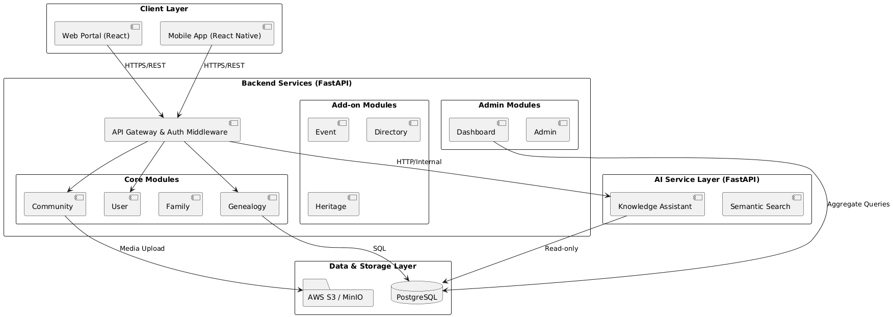
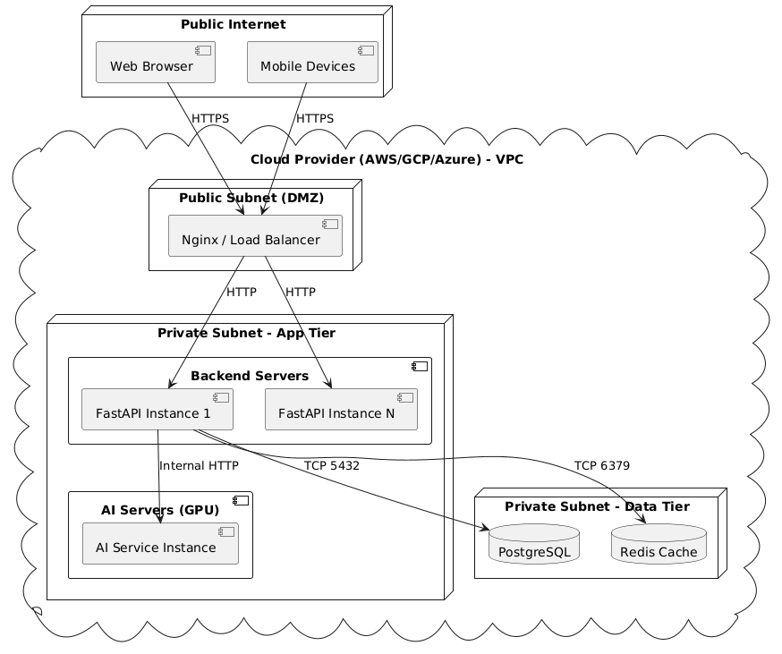
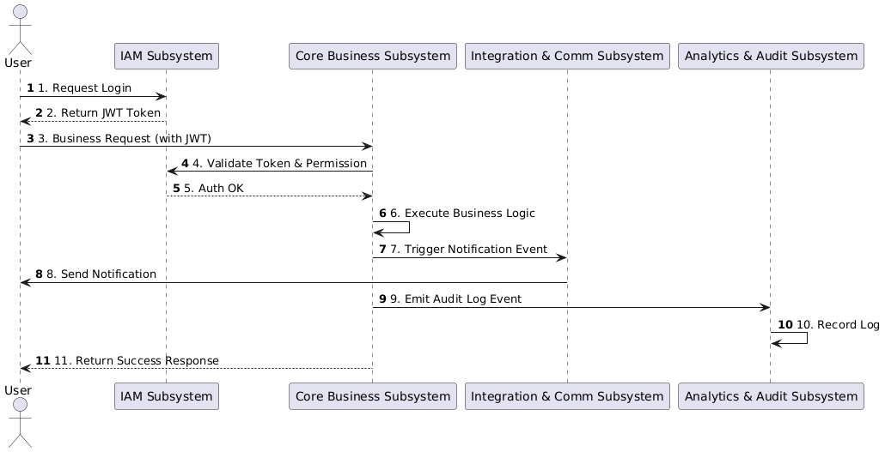

# 1. System Architecture Design

> **Dự án:** FamilyConnect
> **Tài liệu:** System Architecture Design Document (SAD)
> **Jira:** FT8-30
> **Thuộc Epic:** FT8-31, Thiết kế hệ thống (Sprint 3)
> **Trạng thái:** Draft v1.0

---

## 1. Giới thiệu
### 1.1 Mục đích
Tài liệu System Architecture Design (SAD) cung cấp cái nhìn tổng thể về kiến trúc hệ thống của dự án FamilyConnect. Tài liệu định nghĩa các hệ thống con (subsystems), các phân hệ (modules), nguyên tắc giao tiếp giữa chúng, và các quyết định kiến trúc cốt lõi nhằm đáp ứng các yêu cầu chức năng (FR) và phi chức năng (NFR) đã được định nghĩa trong tài liệu SRS.

### 1.2 Phạm vi
Phạm vi tài liệu tập trung ở mức **kiến trúc tổng thể (Architecture Level)**, bao gồm:
* Cấu trúc Subsystems và ranh giới hệ thống.
* Sự phân chia các Modules logic bên trong Backend.
* Giao thức giao tiếp giữa các thành phần.
* Topology triển khai (Deployment view).

*Lưu ý: Tài liệu này không bao gồm chi tiết thiết kế cơ sở dữ liệu (ERD), đặc tả API chi tiết, hay thiết kế giao diện (UI/UX).*

### 1.3 Đối tượng đọc
* **Project Manager / Product Owner:** Hiểu về cấu trúc tổng thể và đánh giá rủi ro kỹ thuật.
* **System Architect / Tech Lead:** Dùng làm kim chỉ nam để giám sát việc phát triển.
* **Backend / Frontend / Mobile Developers:** Nắm được ranh giới công việc, cách thức giao tiếp giữa các services để tiến hành implement.
* **DevOps / SysAdmin:** Chuẩn bị hạ tầng triển khai dựa trên Deployment View.

## 2. Architecture Drivers
### 2.1 Functional Requirements ảnh hưởng kiến trúc
| Source | Nội dung | Ảnh hưởng kiến trúc |
|---|---|---|
| FR-US-01, FR-US-02 | User authentication, JWT, Phân quyền | Hình thành Security layer, Auth middleware dùng chung cho toàn hệ thống. |
| FR-FG-* | Quản lý cây gia phả (Genealogy tree) | Yêu cầu cấu trúc dữ liệu đồ thị, hình thành module chuyên trách xử lý đệ quy/đồ thị. |
| FR-CM-* | Quản lý cộng đồng (Post, Comment, Media) | Đòi hỏi giải pháp lưu trữ Object Storage cho Media và kiến trúc truy vấn có độ trễ thấp. |

### 2.2 Non-Functional Requirements ảnh hưởng kiến trúc
| Source | Nội dung | Ảnh hưởng kiến trúc |
|---|---|---|
| NFR-05 | Modular architecture | Định hình ranh giới Subsystems & Modules rõ ràng, giảm thiểu dependency chéo (Low coupling). |
| NFR-08 | Tích hợp AI Service (Semantic search, Assistant) | Tách riêng AI Service Layer để dễ dàng scale GPU/Compute độc lập với API xử lý logic thông thường. |
| NFR-01 | Hiệu năng phản hồi API < 200ms | Bắt buộc thiết kế Stateless API và khả năng Caching ở Database Layer/API Layer. |

### 2.3 Use Cases ảnh hưởng kiến trúc
| Source | Nội dung | Ảnh hưởng kiến trúc |
|---|---|---|
| UC-01 | Login / Đăng nhập hệ thống | Quyết định cơ chế quản lý Token tập trung tại Backend Subsystem. |
| UC-05 | Hiển thị và thao tác cây gia phả | Yêu cầu Frontend và Backend phải có API tối ưu để tải node lười (lazy loading) tránh quá tải payload. |

### 2.4 Business Rules ảnh hưởng kiến trúc
| Source | Nội dung | Ảnh hưởng kiến trúc |
|---|---|---|
| BR-FG-01 | Ràng buộc quan hệ huyết thống/hôn nhân | Ảnh hưởng đến Data Model và các Validation Rules đặt tại tầng Business Logic. |

## 3. System Architecture
### 3.1 Architecture Style/Model
Hệ thống FamilyConnect áp dụng mô hình kiến trúc **Modular Monolith Transition-Ready Architecture** kết hợp với **Service-Oriented** ở một số thành phần đặc thù. 

* **Giải nghĩa Modular:** 
  * Backend Service được xây dựng theo hướng *Modular Monolith*. Codebase và database tạm thời chạy trên một tiến trình (process) để tối ưu chi phí phát triển ban đầu, nhưng logic được chia tách thành các module độc lập tuyệt đối (giao tiếp qua Interface/Service layer, không gọi chéo DB).
  * Ứng dụng client (Web/Mobile) và dịch vụ AI được tách biệt hoàn toàn thành các *Services* riêng biệt.
* **Rationale:**
  * Hướng đi này đáp ứng đúng định hướng từ SRS. Tách biệt AI Service giúp tối ưu tài nguyên (AI cần GPU/RAM lớn). Mô hình Modular Monolith cho Backend giúp dễ maintain, giảm overhead DevOps giai đoạn đầu, nhưng vẫn có thể dễ dàng tách thành Microservices (nhờ NFR-05) khi dự án scale-up.

### 3.2 Architecture Decisions
| ID | Decision | Rationale | Alternatives Considered | Consequences |
|---|---|---|---|---|
| **AD-01** | Use FastAPI for Backend | Hiệu năng cao, hỗ trợ Async I/O tốt, hệ sinh thái Python mạnh mẽ dễ làm việc với team AI. | Django, Flask | Cần làm quen với Async I/O; code cần tuân thủ strict typing (Pydantic). |
| **AD-02** | Separate AI Service Layer | AI model cần thư viện riêng (PyTorch), tài nguyên phần cứng khác biệt, cần scale và deploy độc lập. | Monolithic (Gộp chung AI) | Tăng độ trễ network nội bộ; cần thiết kế fallback khi AI Service gặp sự cố. |
| **AD-03** | PostgreSQL for Database | Hỗ trợ tốt Relational Data (ACID) và có Ltree extension xử lý tốt cấu trúc cây gia phả đệ quy. | MongoDB, Neo4j | Schema phải định nghĩa cứng, khó thay đổi linh hoạt như NoSQL. |

### 3.3 Architecture Constraints
* **Stateless:** Tất cả Backend API và AI API phải là stateless. Session state được lưu trữ qua JWT Token hoặc external cache.
* **Cross-Origin:** Frontend Web và Mobile gọi API phải thông qua kiểm soát CORS hợp lệ.
* **Separation of Concerns:** DB Layer chỉ chịu trách nhiệm lưu trữ, cấm viết business logic (Store Procedures/Triggers) dưới Database.

## 4. Subsystem Structure
### 4.1 Danh sách subsystems
1. **Web Management Portal (React/TypeScript)**
2. **Mobile Application (React Native)**
3. **Backend Services (FastAPI)**
4. **AI Service Layer (Python/FastAPI/LLM)**
5. **Database & Storage Layer (PostgreSQL / S3)**

### 4.2 Chi tiết từng subsystem
* **Web Management Portal:**
  * Trách nhiệm: Giao diện Web dành cho Quản trị viên (Admin) quản lý cây gia phả diện rộng, xem báo cáo, kiểm duyệt.
  * Ranh giới: Chỉ vận hành trên trình duyệt, không lưu trữ dữ liệu nhạy cảm local.
  * Dependencies: Backend Services.
* **Mobile Application:**
  * Trách nhiệm: Trải nghiệm cho thành viên gia đình (End-users) với thao tác nhanh: xem thông báo, chat, tìm kiếm người thân.
  * Ranh giới: Native OS capabilities thông qua React Native (iOS/Android).
  * Dependencies: Backend Services.
* **Backend Services:**
  * Trách nhiệm: Xử lý Business Logic, xác thực, phân quyền, đóng gói dữ liệu và cung cấp RESTful APIs.
  * Ranh giới: Không xử lý UI, không trực tiếp chạy model AI nặng.
  * Dependencies: Database & Storage Layer, AI Service Layer.
* **AI Service Layer:**
  * Trách nhiệm: Xử lý Semantic Search, Knowledge Assistant, nhận data từ Backend và trả về kết quả JSON.
  * Ranh giới: Môi trường biệt lập (GPU support), stateless inference, không kết nối trực tiếp Client.
  * Dependencies: Nhận data từ Backend hoặc Read-only từ Database.
* **Database & Storage Layer:**
  * Trách nhiệm: Lưu trữ bền vững (Persistent) dữ liệu quan hệ (PostgreSQL) và Media Objects (S3).
  * Ranh giới: Chỉ tập trung data, không public access, chỉ Backend & AI (read-only) được phép truy cập.

## 5. Module Structure
### 5.1 Module overview
Kiến trúc Backend được module hóa thành **9 module cốt lõi**, hoạt động độc lập và tương tác qua Module Interfaces.

### 5.2 Chi tiết từng module
| Tên Module | Trách nhiệm | Interfaces (Mức kiến trúc) | Dependencies |
|---|---|---|---|
| **1. User Module** | Xác thực, cấp JWT token, phân quyền (RBAC), quản lý profile người dùng cơ bản. | `POST /auth/login` `GET /users/me` | (No internal deps). Phụ thuộc hệ thống mail ngoài. |
| **2. Family Module** | Quản lý thông tin gia đình/chi họ, duyệt thành viên vào gia đình. | `POST /families` `GET /families/{id}/members` | User Module. |
| **3. Genealogy Module**| Quản lý cấu trúc cây gia phả (Nodes, Edges), quan hệ huyết thống. | `GET /genealogy/tree` `POST /genealogy/nodes` | User Module, Family Module. |
| **4. Community Module**| Quản lý bảng tin nội bộ, bài viết, bình luận, xử lý Media upload. | `GET /feed` `POST /posts` | User Module, Storage Layer. |
| **5. Event Module** | Tạo sự kiện (giỗ chạp, họp họ), RSVP, lên lịch nhắc nhở. | `POST /events` `PUT /events/rsvp` | User Module, Family Module. |
| **6. Directory Module**| Tìm kiếm thành viên, danh bạ nghề nghiệp. | `GET /directory/search` | User Module. |
| **7. Heritage Module** | Quản lý kho lưu trữ tài liệu lịch sử, câu chuyện dòng họ. | `POST /heritage/stories` | Family Module, Storage Layer. |
| **8. Dashboard Module**| Tính toán thống kê (số lượng thành viên, độ tuổi) để vẽ biểu đồ. | `GET /analytics/demographics`| View-only data từ modules khác. |
| **9. Admin Module** | Quản lý toàn hệ thống, block users, audit logs, cấu hình global. | `GET /admin/users` `GET /admin/audit-logs`| Tất cả modules (View-only), User Module. |

## 6. Inter-subsystem Communication
### 6.1 Communication protocols
* **Web/Mobile ↔ Backend:** Giao tiếp qua **RESTful API** sử dụng HTTP/HTTPS.
* **Backend ↔ AI Service:** Tương tác Server-to-Server qua **RESTful API (HTTP)**.
* **Backend ↔ Database:** Giao tiếp qua TCP (PostgreSQL protocol), sử dụng ORM kết hợp Raw SQL.

### 6.2 Data flow
*(Ví dụ luồng xử lý: Trợ lý ảo AI)*
1. Client gửi HTTP Request (query) tới Backend API.
2. Backend API validate JWT token và chuẩn bị Context (rút trích thông tin gia phả từ Database).
3. Backend gọi HTTP POST (Prompt + Context) sang AI Service Layer.
4. AI Service phân tích ngữ nghĩa, trả về JSON cho Backend.
5. Backend format lại dữ liệu và trả HTTP Response về cho Client.

### 6.3 Authentication/authorization flow
* **Giao thức:** **JWT (JSON Web Token)** Bearer.
* **Authentication:** Client login qua `User Module` $\rightarrow$ Nhận `access_token` và `refresh_token`.
* **Authorization:** Client gửi Request đính kèm Header `Authorization: Bearer <token>`. Middleware tại Backend giải mã Token. Nếu hợp lệ, gắn User Context vào luồng xử lý để các Modules tiếp tục kiểm tra quyền hạn (RBAC) ở mức API Endpoint.
* **Error Handling:** Trả về chuẩn HTTP Status Codes `401 Unauthorized` hoặc `403 Forbidden`.

## 7. Architecture Views
### 7.1 System Architecture Diagram

### 7.2 Deployment View

### 7.3 Subsystem Interaction View

## 8. SRS → Architecture Traceability
| SRS Element | Architecture Element | Justification (Lý giải) |
|---|---|---|
| **FR-US-01** (User auth) | User Module + JWT Middleware flow | Cần kiến trúc bảo mật tập trung để quản lý phiên và quyền người dùng. |
| **NFR-05** (Modular) | Subsystem structure & 9 Backend Modules | Áp đặt constraint chia tách logic để dễ maintain và scale sau này. |
| **UC-05** (Genealogy tree) | Genealogy Module + PostgreSQL Ltree | Đòi hỏi thiết kế module chuyên sâu quản lý thuật toán đồ thị huyết thống. |
| **NFR-08** (AI integration)| AI Service Layer | Tách biệt layer giúp giải quyết bài toán khác biệt về requirements phần cứng (GPU). |
| **FR-CM-02** (Media upload)| Community Module + Storage Layer | Sinh ra kiến trúc S3 object storage riêng thay vì lưu ảnh vào DB relational. |

## 9. References
1. *FamilyConnect Software Requirements Specification (SRS) - v1.2*
2. *FamilyConnect UI/UX Wireframes*
3. *Jira Epic FT8-31 / Ticket FT8-30*

## 10. Revision History
| Version | Date | Author | Description |
|---|---|---|---|
| 1.0 | 12/08/2026 | Architect Team | Draft v1.0 - Khởi tạo tài liệu SAD, định nghĩa Subsystems, Modules và Deployment Views. |