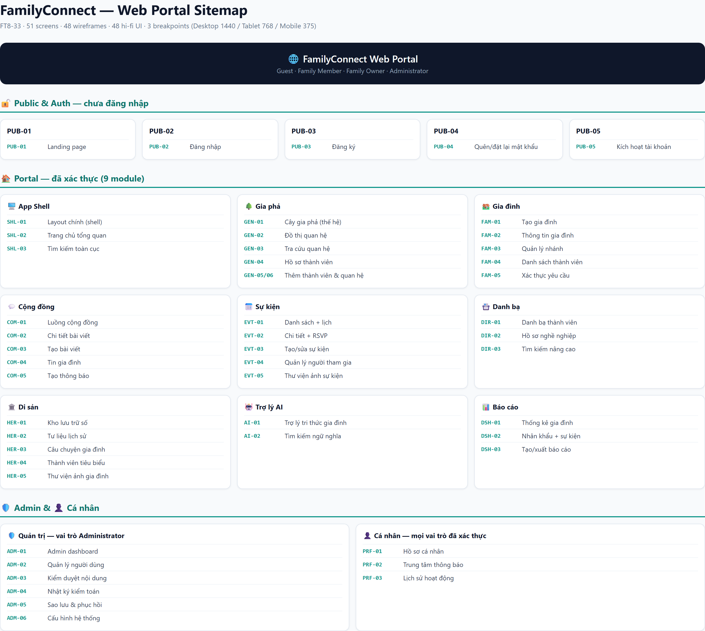

# 03. UI/UX Design

> **Dự án:** FamilyConnect, Nền tảng Cộng đồng Gia đình số tích hợp Trí tuệ nhân tạo
> **Tài liệu:** UI/UX Design Document (Web Portal)
> **Jira:** FT8-33, Thiết kế UI/UX Web Portal
> **Thuộc Epic:** FT8-31, Thiết kế hệ thống (Sprint 3)
> **Trạng thái:** Draft v1.0

---

## 1. Giới thiệu

### 1.1 Mục đích
Tài liệu đặc tả thiết kế giao diện (UI/UX) cho **Web Portal** của FamilyConnect: sơ đồ cây thông tin (sitemap), luồng người dùng (user flows), wireframes, thiết kế giao diện độ phân giải cao (hi-fi UI), design system và ma trận truy vết (traceability) từ SRS đến màn hình.

### 1.2 Phạm vi
- **Trong phạm vi:** Web Portal (trang giới thiệu, trang công khai, portal đã xác thực, admin dashboard), responsive 3 breakpoint (Desktop 1440px / Tablet 768px / Mobile 375px), design system, prototype tương tác.
- **Ngoài phạm vi:** Mobile Application (React Native), thiết kế hệ thống backend (thuộc FT8-30, FT8-34), API chi tiết (FT8-35).

### 1.3 Công cụ bắt buộc
- **Google Stitch** (bắt buộc): tạo design system `.gdd`, hi-fi UI và prototype tương tác.
- Wireframes: bản vẽ tay/kỹ thuật số, xuất PNG.

### 1.4 Đối tượng đọc
- Frontend Developers (React/TypeScript): triển khai giao diện.
- Backend Developers: hiểu màn hình để đối chiếu API.
- Tester: xây dựng test case giao diện.
- Giảng viên / Hội đồng chấm: đánh giá thiết kế.

### 1.5 Tài liệu tham chiếu
| Mã | Tài liệu | Trạng thái |
|----|----------|------------|
| FT8-2..FT8-13 | SRS (docs/SRS/) | Final v1.0 |
| FT8-30 | 01_SystemArchitectureDesign.md | Draft v1.0 |
| FT8-32 | 02_* (thiết kế DB, nếu có) | - |

---

## 2. Nguyên tắc thiết kế (Design Principles)

1. **Gia đình trước tiên (Family-first):** Mọi màn hình lấy gia đình và các mối quan hệ làm trung tâm, ngôn ngữ xưng hô Việt Nam (thân tộc) được ưu tiên.
2. **Đơn giản cho mọi lứa tuổi:** Đối tượng gồm người lớn tuổi, giao diện chữ to, tương phản cao, thao tác tối giản.
3. **Nhất quán (Consistency):** Toàn bộ màn hình dùng chung design system (màu, typography, components) từ Google Stitch.
4. **Phân quyền rõ ràng (RBAC-driven):** Menu và thao tác hiển thị theo vai trò (Guest, Member, Owner, Admin).
5. **Responsive-first:** Thiết kế từ Mobile 375 lên Desktop 1440; quản trị và form nặng tối ưu trên Desktop, core thao tác (xem cây, feed, RSVP) hoạt động đầy đủ trên Mobile.
6. **AI là trợ lý, không thay thế:** Mọi phản hồi AI hiển thị kèm trích dẫn nguồn và trạng thái fallback khi AI không khả dụng.

---

## 3. Danh sách màn hình (Screen List)

> Nguồn: đối chiếu 49 FR (FT8-6), 12 UC (FT8-10), 10 BPM (FT8-13) và 9 module kiến trúc (FT8-30).

### 3.1 Sitemap

### 3.2 Danh sách 51 màn hình

| STT | Mã màn hình | Nhóm | Tên màn hình | Mã nguồn (FR/UC/BPM) |
|:---:|:---:|---|---|---|
| 1 | PUB-01 | Public & Auth | Landing page | - |
| 2 | PUB-02 | Public & Auth | Đăng nhập | FR-US-02, UC-01, BPM-2 |
| 3 | PUB-03 | Public & Auth | Đăng ký | FR-US-01, UC-02, BPM-1 |
| 4 | PUB-04 | Public & Auth | Quên mật khẩu / Đặt lại | FR-US-04 |
| 5 | PUB-05 | Public & Auth | Kích hoạt tài khoản | FR-US-01 (A3, A4) |
| 6 | SHL-01 | App Shell & Dashboard | Layout chính (header + nav + notification) | - |
| 7 | SHL-02 | App Shell & Dashboard | Trang chủ tổng quan (feed + gợi ý AI) | FR-DASH-02, FR-AI-05 |
| 8 | SHL-03 | App Shell & Dashboard | Tìm kiếm toàn cục | FR-AI-01 |
| 9 | GEN-01 | Gia phả | Cây gia phả thế hệ (interactive tree) | FR-FG-06, UC-05 |
| 10 | GEN-02 | Gia phả | Đồ thị quan hệ (relationship graph) | FR-FG-07 |
| 11 | GEN-03 | Gia phả | Tra cứu quan hệ + giải thích AI | FR-FG-08, FR-AI-03 |
| 12 | GEN-04 | Gia phả | Hồ sơ thành viên (chi tiết) | FR-FG-03, FR-DIR-01 |
| 13 | GEN-05 | Gia phả | Thêm / sửa thành viên | FR-FG-03, UC-04, BPM-5 |
| 14 | GEN-06 | Gia phả | Thiết lập quan hệ (cha-con / hôn nhân) | FR-FG-04, FR-FG-05 |
| 15 | FAM-01 | Quản lý gia đình | Tạo gia đình | FR-FG-01, BPM-3 |
| 16 | FAM-02 | Quản lý gia đình | Thông tin gia đình (sửa, chuyển Owner) | FR-FG-01 |
| 17 | FAM-03 | Quản lý gia đình | Quản lý nhánh | FR-FG-02 |
| 18 | FAM-04 | Quản lý gia đình | Danh sách thành viên | FR-FG-03, FR-US-07, BPM-4 |
| 19 | FAM-05 | Quản lý gia đình | Xác thực yêu cầu tham gia | FR-US-07, BPM-4 |
| 20 | COM-01 | Cộng đồng | Luồng cộng đồng (feed) | FR-COM-01 |
| 21 | COM-02 | Cộng đồng | Chi tiết bài viết + bình luận | FR-COM-02 |
| 22 | COM-03 | Cộng đồng | Tạo bài viết | FR-COM-01 |
| 23 | COM-04 | Cộng đồng | Tin gia đình | FR-COM-03 |
| 24 | COM-05 | Cộng đồng | Tạo thông báo (announcement) | FR-COM-05 |
| 25 | EVT-01 | Sự kiện | Danh sách sự kiện + lịch | FR-EVT-01 |
| 26 | EVT-02 | Sự kiện | Chi tiết sự kiện + RSVP | FR-EVT-02, BPM-9 |
| 27 | EVT-03 | Sự kiện | Tạo / sửa sự kiện | FR-EVT-01, BPM-8 |
| 28 | EVT-04 | Sự kiện | Quản lý người tham gia | FR-EVT-03 |
| 29 | EVT-05 | Sự kiện | Thư viện ảnh sự kiện | FR-EVT-04 |
| 30 | DIR-01 | Danh bạ | Danh bạ thành viên | FR-DIR-01 |
| 31 | DIR-02 | Danh bạ | Hồ sơ chi tiết (nghề nghiệp / học vấn) | FR-DIR-02, FR-DIR-03 |
| 32 | DIR-03 | Danh bạ | Tìm kiếm nâng cao | FR-DIR-04 |
| 33 | HER-01 | Di sản | Kho lưu trữ số | FR-HER-05 |
| 34 | HER-02 | Di sản | Tư liệu lịch sử | FR-HER-01 |
| 35 | HER-03 | Di sản | Câu chuyện gia đình | FR-HER-02 |
| 36 | HER-04 | Di sản | Thành viên tiêu biểu | FR-HER-03 |
| 37 | HER-05 | Di sản | Thư viện ảnh gia đình | FR-HER-04 |
| 38 | AI-01 | AI | Trợ lý tri thức (chat + RAG) | FR-AI-02, UC-10, BPM-10 |
| 39 | AI-02 | AI | Kết quả tìm kiếm ngữ nghĩa | FR-AI-01 |
| 40 | DSH-01 | Dashboard & Báo cáo | Thống kê gia đình | FR-DASH-01 |
| 41 | DSH-02 | Dashboard & Báo cáo | Thống kê nhân khẩu + sự kiện | FR-DASH-03, FR-DASH-04 |
| 42 | DSH-03 | Dashboard & Báo cáo | Tạo / xuất báo cáo | FR-DASH-05 |
| 43 | ADM-01 | Admin | Admin dashboard | FR-DASH-02, FR-ADM-01 |
| 44 | ADM-02 | Admin | Quản lý người dùng | FR-ADM-01, UC-12 |
| 45 | ADM-03 | Admin | Kiểm duyệt nội dung | FR-ADM-02 |
| 46 | ADM-04 | Admin | Nhật ký kiểm toán (audit log) | FR-ADM-03 |
| 47 | ADM-05 | Admin | Sao lưu & phục hồi | FR-ADM-04 |
| 48 | ADM-06 | Admin | Cấu hình hệ thống | FR-ADM-05 |
| 49 | PRF-01 | Cá nhân | Hồ sơ cá nhân / cài đặt | FR-US-03, FR-US-06 |
| 50 | PRF-02 | Cá nhân | Trung tâm thông báo | FR-COM-05, FR-EVT-05 |
| 51 | PRF-03 | Cá nhân | Lịch sử hoạt động / báo cáo đã xuất | FR-DASH-05 |

> **Ghi chú:** 51 màn hình chốt từ SRS (draft 48 + 3 bổ sung: PUB-05 Kích hoạt tài khoản, SHL-03 Tìm kiếm toàn cục, AI-02 Kết quả tìm kiếm ngữ nghĩa).

---

## 4. User Flows

> 7 luồng chính chọn từ 10 BPM (FT8-13) + 12 UC (FT8-10), bao phủ MVP.

| STT | Mã flow | Tên luồng | Màn hình tham gia | Nguồn |
|:---:|:---:|---|---|---|
| 1 | UF-01 | Đăng ký & kích hoạt tài khoản | PUB-03 → PUB-05 → PUB-02 | FR-US-01, UC-02, BPM-1 |
| 2 | UF-02 | Đăng nhập & điều hướng theo vai trò | PUB-02 → SHL-01 → (SHL-02 / ADM-01) | FR-US-02, UC-01, BPM-2 |
| 3 | UF-03 | Tạo gia đình & thêm thành viên đầu tiên | FAM-01 → GEN-05 → GEN-01 | FR-FG-01, FR-FG-03, BPM-3, BPM-5 |
| 4 | UF-04 | Xác thực thành viên tham gia gia đình | FAM-05 → FAM-04 → GEN-01 | FR-US-07, BPM-4 |
| 5 | UF-05 | Quản lý cây gia phả (thêm thành viên + quan hệ) | GEN-01 → GEN-05 / GEN-06 → GEN-04 | FR-FG-03→06, UC-04, UC-05, BPM-6 |
| 6 | UF-06 | Tạo sự kiện & quản lý RSVP | EVT-03 → EVT-02 → EVT-04 | FR-EVT-01→03, BPM-8, BPM-9 |
| 7 | UF-07 | Tra cứu tri thức gia đình bằng AI | SHL-03 → AI-02 / AI-01 | FR-AI-01, FR-AI-02, UC-10, BPM-10 |

Diagrams: `design-system/user-flows/UF-01..UF-07.png`

---

## 5. Wireframes

- Tổng số: **48 wireframes** (51 screens, gộp màn hình con cùng template: GEN-05/GEN-06 dùng chung form template; PRF-02/PRF-03 dùng chung list template).
- Mỗi wireframe đủ 3 breakpoint: Desktop 1440 / Tablet 768 / Mobile 375.
- Vị trí: `design-system/wireframes/`

| STT | Mã | Wireframe |
|:---:|:---:|---|
| 1 | W-01 | PUB-01 Landing page |
| 2 | W-02 | PUB-02 Đăng nhập |
| 3 | W-03 | PUB-03 Đăng ký |
| 4 | W-04 | PUB-04 Quên / đặt lại mật khẩu |
| 5 | W-05 | PUB-05 Kích hoạt tài khoản |
| 6 | W-06 | SHL-01 Layout chính |
| 7 | W-07 | SHL-02 Trang chủ tổng quan |
| 8 | W-08 | SHL-03 Tìm kiếm toàn cục |
| 9 | W-09 | GEN-01 Cây gia phả thế hệ |
| 10 | W-10 | GEN-02 Đồ thị quan hệ |
| 11 | W-11 | GEN-03 Tra cứu quan hệ |
| 12 | W-12 | GEN-04 Hồ sơ thành viên |
| 13 | W-13 | GEN-05/GEN-06 Form thêm thành viên & quan hệ |
| 14 | W-14 | FAM-01 Tạo gia đình |
| 15 | W-15 | FAM-02 Thông tin gia đình |
| 16 | W-16 | FAM-03 Quản lý nhánh |
| 17 | W-17 | FAM-04 Danh sách thành viên |
| 18 | W-18 | FAM-05 Xác thực yêu cầu tham gia |
| 19 | W-19 | COM-01 Luồng cộng đồng |
| 20 | W-20 | COM-02 Chi tiết bài viết |
| 21 | W-21 | COM-03 Tạo bài viết |
| 22 | W-22 | COM-04 Tin gia đình |
| 23 | W-23 | COM-05 Tạo thông báo |
| 24 | W-24 | EVT-01 Danh sách sự kiện + lịch |
| 25 | W-25 | EVT-02 Chi tiết sự kiện + RSVP |
| 26 | W-26 | EVT-03 Tạo / sửa sự kiện |
| 27 | W-27 | EVT-04 Quản lý người tham gia |
| 28 | W-28 | EVT-05 Thư viện ảnh sự kiện |
| 29 | W-29 | DIR-01 Danh bạ thành viên |
| 30 | W-30 | DIR-02 Hồ sơ nghề nghiệp / học vấn |
| 31 | W-31 | DIR-03 Tìm kiếm nâng cao |
| 32 | W-32 | HER-01 Kho lưu trữ số |
| 33 | W-33 | HER-02 Tư liệu lịch sử |
| 34 | W-34 | HER-03 Câu chuyện gia đình |
| 35 | W-35 | HER-04 Thành viên tiêu biểu |
| 36 | W-36 | HER-05 Thư viện ảnh gia đình |
| 37 | W-37 | AI-01 Trợ lý tri thức |
| 38 | W-38 | AI-02 Kết quả tìm kiếm ngữ nghĩa |
| 39 | W-39 | DSH-01 Thống kê gia đình |
| 40 | W-40 | DSH-02 Thống kê nhân khẩu + sự kiện |
| 41 | W-41 | DSH-03 Tạo / xuất báo cáo |
| 42 | W-42 | ADM-01 Admin dashboard |
| 43 | W-43 | ADM-02 Quản lý người dùng |
| 44 | W-44 | ADM-03 Kiểm duyệt nội dung |
| 45 | W-45 | ADM-04 Nhật ký kiểm toán |
| 46 | W-46 | ADM-05 Sao lưu & phục hồi |
| 47 | W-47 | ADM-06 Cấu hình hệ thống |
| 48 | W-48 | PRF-01/02/03 Hồ sơ cá nhân, thông báo, lịch sử |

---

## 6. Thiết kế giao diện hi-fi (Hi-fi UI)

- Tổng số: **48 hi-fi UI** tương ứng wireframes (điều kiện FT8-33).
- Thực hiện trên **Google Stitch**, xuất PNG.
- Vị trí: `design-system/ui/`

*(Bảng danh sách 48 hi-fi UI: giống Mục 5, thay tiền tố W- bằng UI-)*

---

## 7. Design System (Google Stitch)

- File: `design-system/design-system.gdd`
- Nội dung:
  - Màu sắc (color tokens): primary, secondary, semantic (success/warning/danger/info), neutral scale.
  - Typography: hệ chữ (ưu tiên hỗ trợ tiếng Việt: Be Vietnam Pro / Inter), thang kích thước, line-height.
  - Spacing: 4px grid, spacing scale 4/8/12/16/24/32/48.
  - Components: Button, Input, Select, Checkbox, Radio, Tabs, Table, Card, Modal, Drawer, Toast, Badge, Avatar, Tree Node, Chart, Empty state, Skeleton.
  - Iconography: bộ icon nhất quán.
  - Breakpoints: Desktop 1440 / Tablet 768 / Mobile 375.
  - Accessibility: tương phản AA, kích thước chạm ≥ 44px, focus visible.

---

## 8. Prototype tương tác

- Prototype điều hướng giữa các màn hình hi-fi trên Google Stitch.
- Link: `design-system/prototype-link.txt`

---

## 9. Ma trận truy vết (Traceability)

### 9.1 FR → Screen

| FR | Màn hình |
|----|----------|
| FR-US-01 | PUB-03, PUB-05 |
| FR-US-02 | PUB-02 |
| FR-US-03 | PRF-01 |
| FR-US-04 | PUB-04 |
| FR-US-05 | (toàn hệ thống) SHL-01 |
| FR-US-06 | PRF-01 |
| FR-US-07 | FAM-04, FAM-05 |
| FR-FG-01 | FAM-01, FAM-02 |
| FR-FG-02 | FAM-03 |
| FR-FG-03 | FAM-04, GEN-04, GEN-05 |
| FR-FG-04 | GEN-06, GEN-04 |
| FR-FG-05 | GEN-06, GEN-04 |
| FR-FG-06 | GEN-01 |
| FR-FG-07 | GEN-02 |
| FR-FG-08 | GEN-03 |
| FR-COM-01 | COM-01, COM-03 |
| FR-COM-02 | COM-02 |
| FR-COM-03 | COM-04 |
| FR-COM-04 | COM-01, HER-05, EVT-05 |
| FR-COM-05 | COM-05, PRF-02 |
| FR-EVT-01 | EVT-01, EVT-03 |
| FR-EVT-02 | EVT-02 |
| FR-EVT-03 | EVT-04 |
| FR-EVT-04 | EVT-05 |
| FR-EVT-05 | PRF-02, EVT-02 |
| FR-DIR-01 | DIR-01, GEN-04 |
| FR-DIR-02 | DIR-02 |
| FR-DIR-03 | DIR-02 |
| FR-DIR-04 | DIR-03 |
| FR-HER-01 | HER-02 |
| FR-HER-02 | HER-03 |
| FR-HER-03 | HER-04 |
| FR-HER-04 | HER-05 |
| FR-HER-05 | HER-01 |
| FR-AI-01 | SHL-03, AI-02 |
| FR-AI-02 | AI-01 |
| FR-AI-03 | GEN-03 |
| FR-AI-04 | COM-02, HER-03 |
| FR-AI-05 | SHL-02 |
| FR-DASH-01 | DSH-01 |
| FR-DASH-02 | SHL-02, ADM-01 |
| FR-DASH-03 | DSH-02 |
| FR-DASH-04 | DSH-02 |
| FR-DASH-05 | DSH-03, PRF-03 |
| FR-ADM-01 | ADM-02 |
| FR-ADM-02 | ADM-03 |
| FR-ADM-03 | ADM-04 |
| FR-ADM-04 | ADM-05 |
| FR-ADM-05 | ADM-06 |

### 9.2 UC → Flow

| UC | User Flow |
|----|-----------|
| UC-01 Đăng nhập & Xác thực | UF-02 |
| UC-02 Đăng ký & Xác minh Thành viên | UF-01 |
| UC-03 Quản lý Gia đình & Chi nhánh | UF-03 |
| UC-04 Quản lý Quan hệ Cây gia phả | UF-05 |
| UC-05 Truy vấn & Trực quan hóa Cây gia phả | UF-05 |
| UC-06 Quản lý Bài viết & Tương tác | (luồng phụ: COM-01 → COM-03 → COM-02) |
| UC-07 Quản lý Sự kiện & RSVP | UF-06 |
| UC-08 Tra cứu Danh bạ & Hồ sơ | (luồng phụ: DIR-01 → DIR-03 → DIR-02) |
| UC-09 Quản lý Lưu trữ & Di sản | (luồng phụ: HER-01 → HER-02/03/04/05) |
| UC-10 Trợ lý AI & Truy vấn Tri thức | UF-07 |
| UC-11 Xem Báo cáo & Thống kê | (luồng phụ: DSH-01 → DSH-02 → DSH-03) |
| UC-12 Quản trị Hệ thống & Kiểm duyệt | (luồng phụ: ADM-01 → ADM-02/03/04) |

### 9.3 BPM → Screen

| BPM | Màn hình |
|-----|----------|
| BPM-1 Đăng ký tài khoản | PUB-03, PUB-05 |
| BPM-2 Đăng nhập | PUB-02, SHL-01 |
| BPM-3 Tạo gia đình | FAM-01, FAM-02 |
| BPM-4 Tham gia gia đình | FAM-04, FAM-05 |
| BPM-5 Thêm thành viên vào gia đình | GEN-05, FAM-04 |
| BPM-6 Quản lý cây gia phả | GEN-01, GEN-04, GEN-05, GEN-06 |
| BPM-7 Đăng bài viết | COM-01, COM-03 |
| BPM-8 Tạo sự kiện | EVT-03, EVT-01 |
| BPM-9 Đăng ký tham gia sự kiện (RSVP) | EVT-02, EVT-04 |
| BPM-10 Tra cứu thông tin bằng AI | SHL-03, AI-02, AI-01 |

---

## 10. Lịch sử tài liệu

| Phiên bản | Ngày | Người cập nhật | Mô tả |
|-----------|------|----------------|--------|
| 1.0 | 2026-08-13 | Đặng Hoàng Ân | Khung tài liệu: sitemap, 51 screens, 7 user flows, 48 wireframes, hi-fi, design system, traceability |
