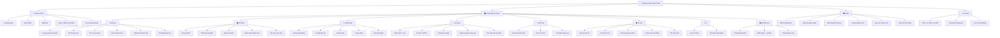

```mermaid
flowchart TD
    ROOT["FamilyConnect Web Portal"]
    ROOT --> AUTH["🔐 Public & Auth"]
    ROOT --> APP["🏠 Portal (đã xác thực)"]
    ROOT --> ADM["🛡️ Admin"]
    ROOT --> PRF["👤 Cá nhân"]

    AUTH --> A1["Landing page"]
    AUTH --> A2["Đăng nhập"]
    AUTH --> A3["Đăng ký"]
    AUTH --> A4["Quên / đặt lại mật khẩu"]
    AUTH --> A5["Kích hoạt tài khoản"]

    APP --> G["🌳 Gia phả"]
    APP --> F["🏘️ Gia đình"]
    APP --> C["💬 Cộng đồng"]
    APP --> E["📅 Sự kiện"]
    APP --> D["📇 Danh bạ"]
    APP --> H["🏛️ Di sản"]
    APP --> AI["🤖 AI"]
    APP --> DS["📊 Dashboard"]

    G --> G1["Cây gia phả tương tác"]
    G --> G2["Đồ thị quan hệ"]
    G --> G3["Tra cứu quan hệ"]
    G --> G4["Hồ sơ thành viên"]
    G --> G5["Thêm/sửa thành viên"]
    G --> G6["Thiết lập quan hệ"]

    F --> F1["Tạo gia đình"]
    F --> F2["Thông tin gia đình"]
    F --> F3["Quản lý nhánh"]
    F --> F4["Danh sách thành viên"]
    F --> F5["Xác thực yêu cầu"]

    C --> C1["Luồng cộng đồng"]
    C --> C2["Chi tiết bài viết"]
    C --> C3["Tạo bài viết"]
    C --> C4["Tin gia đình"]
    C --> C5["Tạo thông báo"]

    E --> E1["Danh sách + lịch"]
    E --> E2["Chi tiết + RSVP"]
    E --> E3["Tạo/sửa sự kiện"]
    E --> E4["Quản lý người tham gia"]
    E --> E5["Thư viện ảnh sự kiện"]

    D --> D1["Danh bạ thành viên"]
    D --> D2["Hồ sơ chi tiết"]
    D --> D3["Tìm kiếm nâng cao"]

    H --> H1["Kho lưu trữ số"]
    H --> H2["Tư liệu lịch sử"]
    H --> H3["Câu chuyện gia đình"]
    H --> H4["Thành viên tiêu biểu"]
    H --> H5["Thư viện ảnh"]

    AI --> AI1["Trợ lý tri thức"]
    AI --> AI2["Tìm kiếm ngữ nghĩa"]

    DS --> DS1["Thống kê gia đình"]
    DS --> DS2["Nhân khẩu + sự kiện"]
    DS --> DS3["Tạo/xuất báo cáo"]

    ADM --> AD1["Admin dashboard"]
    ADM --> AD2["Quản lý người dùng"]
    ADM --> AD3["Kiểm duyệt nội dung"]
    ADM --> AD4["Nhật ký kiểm toán"]
    ADM --> AD5["Sao lưu & phục hồi"]
    ADM --> AD6["Cấu hình hệ thống"]

    PRF --> P1["Hồ sơ cá nhân / cài đặt"]
    PRF --> P2["Trung tâm thông báo"]
    PRF --> P3["Lịch sử hoạt động"]
```
