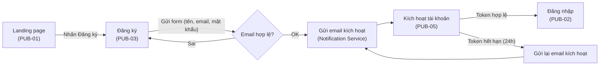

```mermaid
flowchart LR
    A["Landing page<br/>(PUB-01)"] -->|"Nhấn Đăng ký"| B["Đăng ký<br/>(PUB-03)"]
    B -->|"Gửi form (tên, email, mật khẩu)"| C{"Email hợp lệ?"}
    C -->|"Sai"| B
    C -->|"OK"| D["Gửi email kích hoạt<br/>(Notification Service)"]
    D --> E["Kích hoạt tài khoản<br/>(PUB-05)"]
    E -->|"Token hợp lệ"| F["Đăng nhập<br/>(PUB-02)"]
    E -->|"Token hết hạn (24h)"| G["Gửi lại email kích hoạt"]
    G --> D
```
