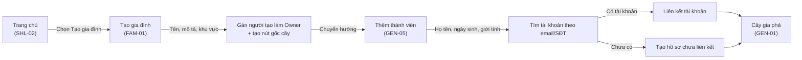

```mermaid
flowchart LR
    A["Trang chủ<br/>(SHL-02)"] -->|"Chọn Tạo gia đình"| B["Tạo gia đình<br/>(FAM-01)"]
    B -->|"Tên, mô tả, khu vực"| C["Gán người tạo làm Owner<br/>+ tạo nút gốc cây"]
    C -->|"Chuyển hướng"| D["Thêm thành viên<br/>(GEN-05)"]
    D -->|"Họ tên, ngày sinh, giới tính"| E["Tìm tài khoản theo email/SĐT"]
    E -->|"Có tài khoản"| F["Liên kết tài khoản"]
    E -->|"Chưa có"| G["Tạo hồ sơ chưa liên kết"]
    F --> H["Cây gia phả<br/>(GEN-01)"]
    G --> H
```
