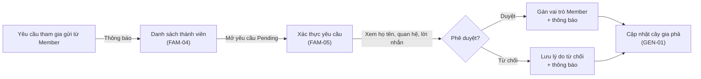

```mermaid
flowchart LR
    A["Yêu cầu tham gia gửi từ Member"] -->|"Thông báo"| B["Danh sách thành viên<br/>(FAM-04)"]
    B -->|"Mở yêu cầu Pending"| C["Xác thực yêu cầu<br/>(FAM-05)"]
    C -->|"Xem họ tên, quan hệ, lời nhắn"| D{"Phê duyệt?"}
    D -->|"Duyệt"| E["Gán vai trò Member<br/>+ thông báo"]
    D -->|"Từ chối"| F["Lưu lý do từ chối<br/>+ thông báo"]
    E --> G["Cập nhật cây gia phả<br/>(GEN-01)"]
    F --> G
```
