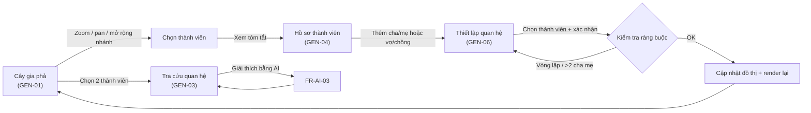

```mermaid
flowchart LR
    A["Cây gia phả<br/>(GEN-01)"] -->|"Zoom / pan / mở rộng nhánh"| B["Chọn thành viên"]
    B -->|"Xem tóm tắt"| C["Hồ sơ thành viên<br/>(GEN-04)"]
    C -->|"Thêm cha/mẹ hoặc vợ/chồng"| D["Thiết lập quan hệ<br/>(GEN-06)"]
    D -->|"Chọn thành viên + xác nhận"| E{"Kiểm tra ràng buộc"}
    E -->|"Vòng lặp / >2 cha mẹ"| D
    E -->|"OK"| F["Cập nhật đồ thị + render lại"]
    F --> A
    A -->|"Chọn 2 thành viên"| G["Tra cứu quan hệ<br/>(GEN-03)"]
    G -->|"Giải thích bằng AI"| H["FR-AI-03"]
    H --> G
```
