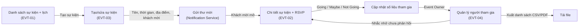

```mermaid
flowchart LR
    A["Danh sách sự kiện + lịch<br/>(EVT-01)"] -->|"Tạo sự kiện"| B["Tạo/sửa sự kiện<br/>(EVT-03)"]
    B -->|"Tên, thời gian, địa điểm, khách mời"| C["Gửi thư mời<br/>(Notification Service)"]
    C -->|"Khách mời mở"| D["Chi tiết sự kiện + RSVP<br/>(EVT-02)"]
    D -->|"Going / Maybe / Not Going"| E["Cập nhật số liệu tham gia"]
    E -->|"Event Owner"| F["Quản lý người tham gia<br/>(EVT-04)"]
    F -->|"Nhắc nhở chưa phản hồi"| D
    F -->|"Xuất danh sách CSV/PDF"| G["Tải file"]
```
