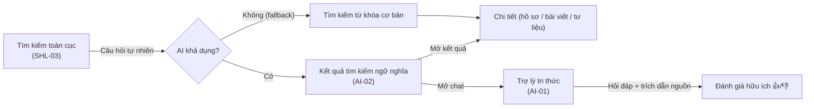

```mermaid
flowchart LR
    A["Tìm kiếm toàn cục<br/>(SHL-03)"] -->|"Câu hỏi tự nhiên"| B{"AI khả dụng?"}
    B -->|"Có"| C["Kết quả tìm kiếm ngữ nghĩa<br/>(AI-02)"]
    B -->|"Không (fallback)"| D["Tìm kiếm từ khóa cơ bản"]
    C -->|"Mở kết quả"| E["Chi tiết (hồ sơ / bài viết / tư liệu)"]
    C -->|"Mở chat"| F["Trợ lý tri thức<br/>(AI-01)"]
    F -->|"Hỏi đáp + trích dẫn nguồn"| G["Đánh giá hữu ích 👍/👎"]
    D --> E
```
