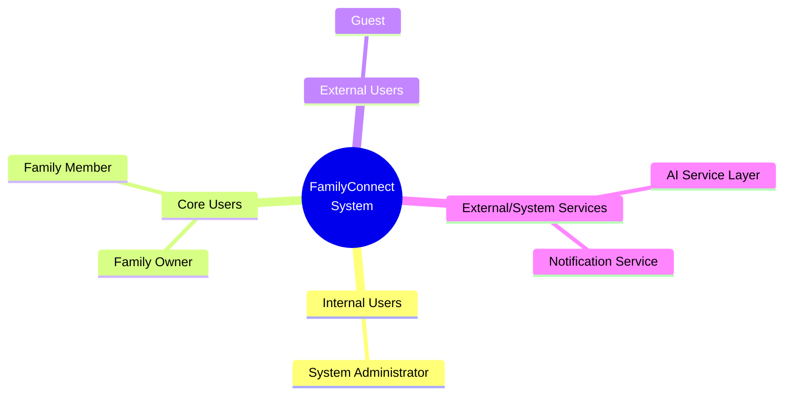

# 02. Stakeholder Analysis

> **Dự án:** FamilyConnect, Nền tảng Cộng đồng Gia đình số tích hợp Trí tuệ nhân tạo
> **Tài liệu:** Phân tích Stakeholder (Stakeholder Analysis)
> **Jira:** [FT8-3](https://familyconnect.atlassian.net/browse/FT8-3), Phân tích Stakeholder
> **Thuộc Epic:** FT8-4, Phân tích yêu cầu hệ thống (Sprint 1)
> **Trạng thái:** Final v1.0

---

## 1. Stakeholder List (Danh sách Stakeholder)

Dựa trên kiến trúc và yêu cầu của hệ thống FamilyConnect, dưới đây là danh sách các bên liên quan:
*   **Guest (Khách)**: Người dùng chưa đăng nhập hoặc đang chờ xác thực.
*   **Family Member (Thành viên gia đình)**: Người dùng cuối, thành viên thuộc một gia tộc đã được xác thực trên hệ thống.
*   **Family Owner (Trưởng gia tộc / Quản trị viên gia đình)**: Người chịu trách nhiệm quản lý thông tin gia phả và các hoạt động của một gia đình/dòng họ cụ thể.
*   **System Administrator (Quản trị viên hệ thống)**: Nhân sự kỹ thuật vận hành, bảo trì và quản lý toàn bộ nền tảng FamilyConnect.
*   **AI Service (Dịch vụ Trí tuệ nhân tạo)**: Hệ thống đóng vai trò như một trợ lý thông minh cung cấp các dịch vụ xử lý ngôn ngữ và gợi ý.
*   **Notification/Email Service (Dịch vụ Thông báo)**: Hệ thống bên thứ ba hỗ trợ gửi email, mã xác thực và nhắc nhở sự kiện.

## 2. Stakeholder Description (Phân tích Stakeholder)

### Guest (Khách)
*   **Vai trò:** Người dùng truy cập hệ thống nhưng chưa có tài khoản hoặc chưa được xác thực vào một gia đình cụ thể.
*   **Mục tiêu:** Tìm hiểu nền tảng, thực hiện đăng ký tài khoản và chờ được phê duyệt để gia nhập không gian số của gia đình.
*   **Quyền hạn:** Xem trang chủ giới thiệu, đăng ký tài khoản, đăng nhập.
*   **Trách nhiệm:** Cung cấp thông tin cá nhân chính xác để quá trình xác minh diễn ra thuận lợi.
*   **Nhu cầu (Needs):** Giao diện đăng ký đơn giản, hướng dẫn rõ ràng, phản hồi nhanh về trạng thái phê duyệt.
*   **Kỳ vọng (Expectations):** Quy trình đăng ký không quá 3 bước, nhận email xác nhận ngay lập tức, thời gian phê duyệt dưới 24 giờ.
*   **Pain Points:** Các nền tảng hiện tại yêu cầu quá nhiều thông tin khi đăng ký, không biết trạng thái phê duyệt, không có hướng dẫn sử dụng ban đầu.
*   **Mức độ ảnh hưởng:** Thấp (Low).
*   **Mức độ quan tâm:** Trung bình (Medium).

### Family Member (Thành viên gia đình)
*   **Vai trò:** Người dùng chính của hệ thống, tương tác trực tiếp qua Web Portal hoặc Mobile Application.
*   **Mục tiêu:** Kết nối với người thân, cập nhật tin tức, xem cây gia phả, tìm kiếm thông tin và tham gia các sự kiện gia đình.
*   **Quyền hạn:** Đăng bài, bình luận, chia sẻ ảnh, xác nhận tham gia sự kiện (RSVP), truy vấn trợ lý AI, xem danh bạ gia đình.
*   **Trách nhiệm:** Tuân thủ quy định của cộng đồng gia đình, bảo mật thông tin nội bộ.
*   **Nhu cầu (Needs):** Giao diện thân thiện cho mọi lứa tuổi, thông báo kịp thời về sự kiện và tin tức mới, cây gia phả trực quan dễ hiểu.
*   **Kỳ vọng (Expectations):** Ứng dụng mobile mượt mà trên iOS/Android, tìm kiếm thông tin nhanh dưới 2 giây, AI trả lời chính xác bằng tiếng Việt.
*   **Pain Points:** Các mạng xã hội hiện tại không phân loại được người thân theo gia đình, khó tìm kiếm thông tin gia phả, không có tính năng nhắc nhở sự kiện gia đình.
*   **Mức độ ảnh hưởng:** Trung bình (Medium).
*   **Mức độ quan tâm:** Cao (High).

### Family Owner (Trưởng gia tộc / Quản trị viên gia đình)
*   **Vai trò:** Người có thẩm quyền cao nhất trong một không gian gia đình (Family workspace).
*   **Mục tiêu:** Số hóa và bảo tồn di sản gia đình, tổ chức sự kiện, gắn kết các thế hệ và quản lý thông tin gia phả chính xác.
*   **Quyền hạn:** Quản lý thành viên (phê duyệt/xóa), quản lý cấu trúc gia phả (thêm nhánh, nút), tạo sự kiện, quản lý kho lưu trữ số (di sản gia đình).
*   **Trách nhiệm:** Duy trì tính chính xác của cây gia phả, điều phối các hoạt động chung của dòng họ.
*   **Nhu cầu (Needs):** Công cụ quản lý gia phả mạnh mẽ, dashboard thống kê hoạt động gia đình, quyền kiểm duyệt nội dung.
*   **Kỳ vọng (Expectations):** Cây gia phả hỗ trợ ít nhất 10 thế hệ, báo cáo hoạt động hàng tháng, dễ dàng phê duyệt thành viên mới từ mobile.
*   **Pain Points:** Các công cụ gia phả truyền thống (Excel, giấy) khó chỉnh sửa, không có nơi tập trung để quản lý sự kiện gia đình, khó liên lạc với tất cả thành viên cùng lúc.
*   **Mức độ ảnh hưởng:** Cao (High).
*   **Mức độ quan tâm:** Cao (High).

### System Administrator (Quản trị viên hệ thống)
*   **Vai trò:** Nhân viên kỹ thuật quản lý hệ thống FamilyConnect thông qua Dashboard.
*   **Mục tiêu:** Đảm bảo hệ thống hoạt động ổn định, bảo mật cao và sẵn sàng mở rộng.
*   **Quyền hạn:** Quản lý toàn bộ người dùng (Role-Based Access Control), kiểm duyệt nội dung, cấu hình hệ thống, thực hiện Backup & Restore.
*   **Trách nhiệm:** Giám sát nhật ký hoạt động (Audit logging), đảm bảo tính sẵn sàng cao (High Availability), hỗ trợ kỹ thuật.
*   **Nhu cầu (Needs):** Admin dashboard trực quan, audit log đầy đủ, công cụ backup/restore một chạm, cảnh báo sự cố tự động.
*   **Kỳ vọng (Expectations):** Uptime ≥ 99.5%, thời gian backup dưới 5 phút, restore dưới 15 phút, phát hiện bất thường trong 1 phút.
*   **Pain Points:** Thiếu công cụ giám sát tập trung, khó phát hiện lạm dụng hệ thống, quy trình backup/restore thủ công tốn thời gian.
*   **Mức độ ảnh hưởng:** Cao (High).
*   **Mức độ quan tâm:** Cao (High).

### AI Service (Dịch vụ Trí tuệ nhân tạo)
*   **Vai trò:** Hệ thống backend cung cấp các tính năng thông minh qua RESTful APIs.
*   **Mục tiêu:** Cung cấp trải nghiệm tìm kiếm ngữ nghĩa, giải thích mối quan hệ và gợi ý nội dung cá nhân hóa.
*   **Quyền hạn:** Truy cập (chỉ đọc) vào đồ thị gia phả và dữ liệu người dùng để huấn luyện hoặc trích xuất ngữ cảnh.
*   **Trách nhiệm:** Phản hồi chính xác các truy vấn của người dùng, hoạt động ổn định và bảo mật dữ liệu.
*   **Nhu cầu (Needs):** API endpoints rõ ràng, dữ liệu gia phả có cấu trúc (JSON/Graph), vector database cho semantic search.
*   **Kỳ vọng (Expectations):** Độ trễ phản hồi dưới 3 giây, độ chính xác giải thích quan hệ ≥ 90%, hỗ trợ tiếng Việt.
*   **Pain Points:** Dữ liệu gia phả không chuẩn hóa, thiếu training data tiếng Việt cho domain gia đình, khó đánh giá chất lượng câu trả lời.
*   **Mức độ ảnh hưởng:** Cao (High), do là tính năng cốt lõi của dự án.
*   **Mức độ quan tâm:** Thấp (Low), do là hệ thống máy móc.

### Notification/Email Service (Dịch vụ Thông báo)
*   **Vai trò:** Hệ thống bên thứ ba (SendGrid, Firebase Cloud Messaging, SMTP) chịu trách nhiệm gửi thông báo qua email và push notification.
*   **Mục tiêu:** Đảm bảo tất cả thông báo quan trọng (xác thực, nhắc nhở sự kiện, phê duyệt thành viên) đến đúng người nhận, đúng thời điểm.
*   **Quyền hạn:** Nhận yêu cầu gửi thông báo từ hệ thống FamilyConnect, quản lý template email/push.
*   **Trách nhiệm:** Gửi thông báo đáng tin cậy (reliable delivery), xử lý bounce/retry, tuân thủ quy định chống spam.
*   **Nhu cầu (Needs):** API tích hợp đơn giản (REST), template email HTML responsive, webhook để tracking delivery status.
*   **Kỳ vọng (Expectations):** Tỷ lệ gửi thành công ≥ 99%, độ trễ dưới 5 giây, hỗ trợ batch sending cho thông báo hàng loạt.
*   **Pain Points:** Email rơi vào spam folder, không có cơ chế retry khi gửi thất bại, khó quản lý nhiều loại template.
*   **Mức độ ảnh hưởng:** Trung bình (Medium), ảnh hưởng đến trải nghiệm người dùng nhưng không phải core feature.
*   **Mức độ quan tâm:** Thấp (Low), do là hệ thống bên thứ ba.

## 3. Stakeholder Matrix (Ma trận Stakeholder)

| Stakeholder | Vai trò (Role) | Quyền hạn (Permissions) | Mức độ ảnh hưởng (Power/Influence) | Mức độ quan tâm (Interest) | Chiến lược quản lý |
| :--- | :--- | :--- | :--- | :--- | :--- |
| **Family Owner** | Quản lý gia đình | Full quyền trong phạm vi gia đình | Cao | Cao | Quản lý chặt chẽ (Manage Closely) |
| **System Admin** | Vận hành hệ thống | Full quyền toàn hệ thống | Cao | Cao | Quản lý chặt chẽ (Manage Closely) |
| **AI Service** | Trợ lý thông minh | Đọc/Xử lý dữ liệu | Cao | Thấp | Giữ hài lòng (Keep Satisfied) |
| **Family Member** | Người dùng cuối | Tương tác, xem gia phả | Trung bình | Cao | Luôn thông tin (Keep Informed) |
| **Guest** | Khách truy cập | Đăng ký, xem giới thiệu | Thấp | Trung bình | Giám sát (Monitor) |
| **Notification Service** | Gửi thông báo | Gửi email/push | Trung bình | Thấp | Giữ hài lòng (Keep Satisfied) |

## 4. Communication Strategy (Chiến lược Giao tiếp)

| Stakeholder | Tần suất | Phương thức | Nội dung chính |
| :--- | :--- | :--- | :--- |
| **Family Owner** | Hàng tuần | Email báo cáo + Dashboard | Thống kê hoạt động gia đình, thành viên mới, sự kiện sắp tới |
| **Family Member** | Real-time | Push notification + In-app | Bài viết mới, bình luận, nhắc nhở sự kiện, tin nhắn từ người thân |
| **System Admin** | Real-time | Dashboard + Alert | Cảnh báo sự cố, audit log anomalies, user reports |
| **AI Service** | On-demand | API logs + Monitoring | Request/response logs, error rates, latency metrics |
| **Guest** | Event-driven | Email | Xác nhận đăng ký, thông báo phê duyệt/từ chối |
| **Notification Service** | Event-driven | Webhook + Dashboard | Delivery status, bounce rates, error logs |

## 5. Stakeholder Map (Sơ đồ Stakeholder)

