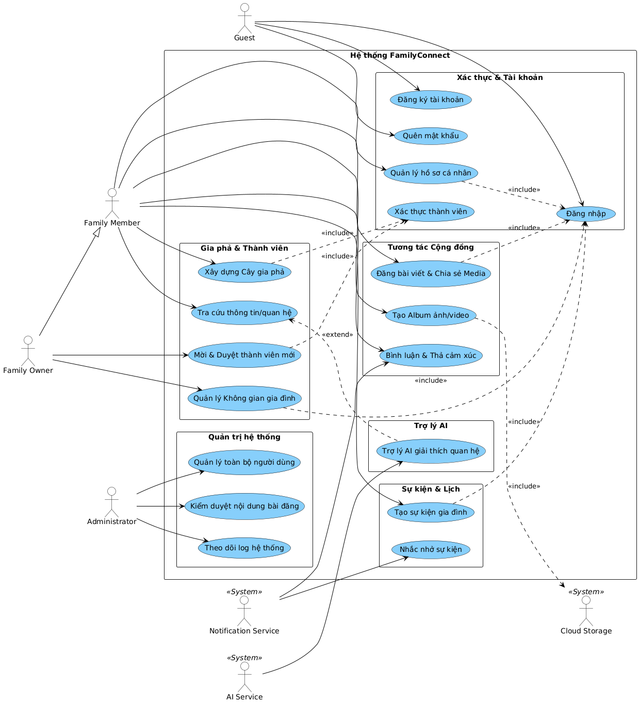

# 06. Use Case Diagram

> **Dự án:** FamilyConnect, Nền tảng Cộng đồng Gia đình số tích hợp Trí tuệ nhân tạo
> **Tài liệu:** Sơ đồ Use Case (Use Case Diagram)
> **Jira:** [FT8-8](https://familyconnect.atlassian.net/browse/FT8-8), Xây dựng Use Case Diagram
> **Thuộc Epic:** FT8-4, Phân tích yêu cầu hệ thống (Sprint 1)
> **Trạng thái:** Final v1.0

---

## 1. Mục tiêu
Xây dựng Use Case Diagram cho hệ thống FamilyConnect nhằm mô hình hóa các chức năng chính và mối quan hệ giữa các Actor với hệ thống. Sơ đồ Use Case là cơ sở để đặc tả Use Case chi tiết và thiết kế hệ thống trong các Sprint tiếp theo.

---

## 2. Xác định Actor (Tác nhân)

| STT | Tên Actor | Loại Actor | Mô tả vai trò & Phạm vi tương tác |
| :---: | :--- | :--- | :--- |
| 1 | **Guest** | Human | Người dùng chưa đăng nhập hoặc truy cập qua liên kết mời (Invite Link). |
| 2 | **Family Member** | Human | Thành viên chính thức trong gia đình, có quyền sử dụng các tính năng tương tác, đăng bài, xem gia phả, sự kiện, danh bạ. |
| 3 | **Family Owner** | Human | Trưởng nhóm / Chủ không gian gia đình, quản lý cây gia phả, nhánh gia đình và duyệt thành viên (Kế thừa toàn bộ quyền từ Family Member). |
| 4 | **Administrator** | Human | Quản trị viên hệ thống toàn cục, quản lý người dùng, kiểm duyệt nội dung, nhật ký và cấu hình hệ thống. |
| 5 | **AI Service** | External System | Tác nhân AI bên ngoài hỗ trợ tìm kiếm ngữ nghĩa, trợ lý AI, tóm tắt và giải thích quan hệ gia đình. |

---

## 3. Danh sách Use Case theo Module Chức năng

### 3.1. User & Security
- **UC1.1:** Đăng ký tài khoản
- **UC1.2:** Đăng nhập
- **UC1.3:** Quên mật khẩu
- **UC1.4:** Quản lý hồ sơ cá nhân
- **UC1.5:** Xác thực thành viên

### 3.2. Family & Genealogy Management
- **UC2.1:** Quản lý gia đình & nhánh gia đình
- **UC2.2:** Quản lý thành viên & quan hệ (cha mẹ - con, hôn nhân)
- **UC2.3:** Xem cây gia phả
- **UC2.4:** Tra cứu quan hệ gia đình

### 3.3. Community
- **UC3.1:** Đăng bài viết & Chia sẻ hình ảnh/tin tức
- **UC3.2:** Bình luận & Thả cảm xúc
- **UC3.3:** Quản lý thông báo

### 3.4. Events
- **UC4.1:** Tạo & Quản lý sự kiện
- **UC4.2:** Quản lý người tham gia & RSVP
- **UC4.3:** Quản lý thư viện ảnh sự kiện
- **UC4.4:** Gửi nhắc nhở sự kiện

### 3.5. Family Directory
- **UC5.1:** Tra cứu thành viên (theo nghề nghiệp, địa điểm, thế hệ)

### 3.6. Family Heritage
- **UC6.1:** Quản lý tư liệu lịch sử & câu chuyện gia đình
- **UC6.2:** Quản lý thành viên tiêu biểu
- **UC6.3:** Quản lý thư viện ảnh & kho lưu trữ số

### 3.7. AI-assisted Services
- **UC7.1:** Tìm kiếm ngữ nghĩa & Gợi ý thành viên/tài nguyên
- **UC7.2:** Trợ lý AI (Giải thích quan hệ gia đình & Tóm tắt nội dung)

### 3.8. Dashboard & Reporting
- **UC8.1:** Xem thống kê (gia đình, cộng đồng, sự kiện)
- **UC8.2:** Xuất báo cáo

### 3.9. Administration
- **UC9.1:** Quản lý người dùng
- **UC9.2:** Kiểm duyệt nội dung
- **UC9.3:** Nhật ký hệ thống & Cấu hình
- **UC9.4:** Sao lưu và phục hồi

---

## 4. Sơ đồ Use Case Diagram (PlantUML Source)

> **Tệp tin đính kèm:**
> - **Ảnh PNG xem trực tiếp:** `docs/SRS/diagrams/UseCase.png`

