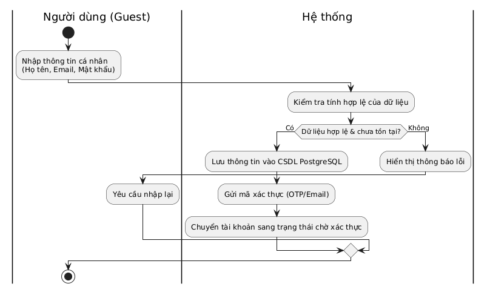
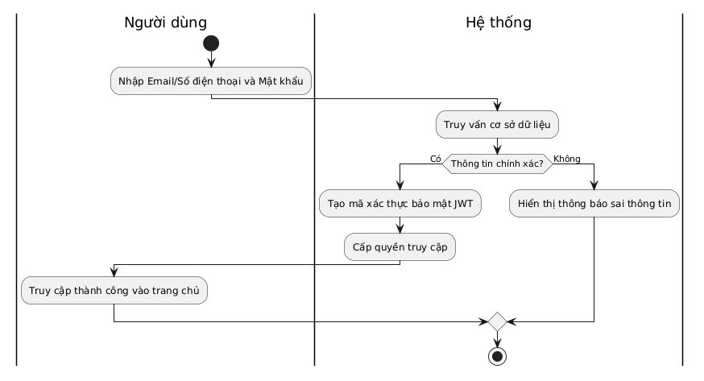
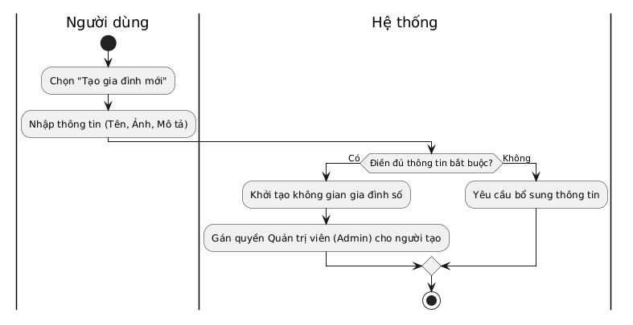
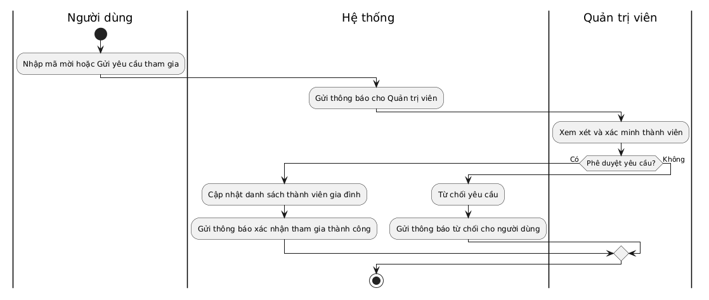
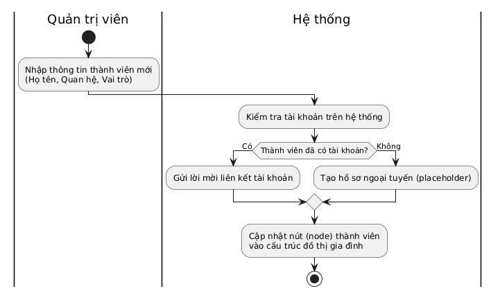
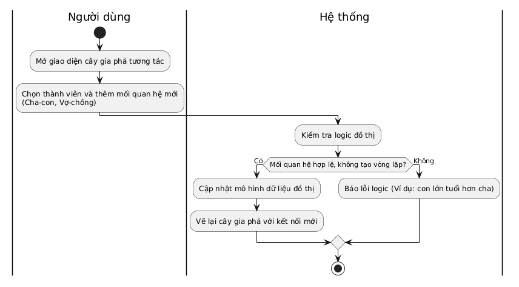
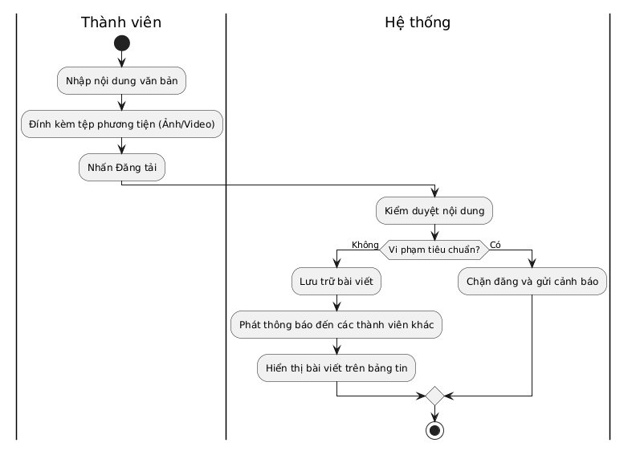
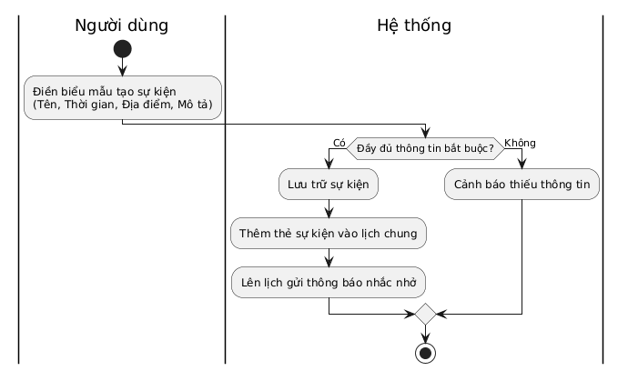
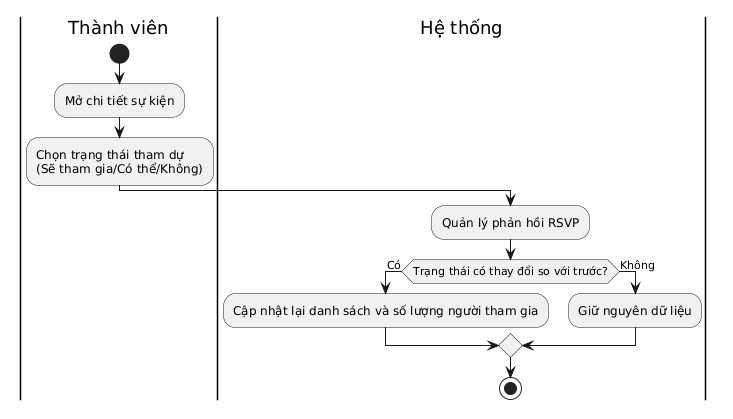
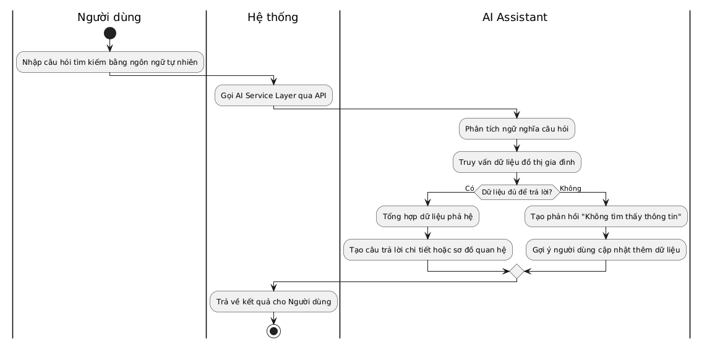

# 10. Business Process Model

> **Dự án:** FamilyConnect, Nền tảng Cộng đồng Gia đình số tích hợp Trí tuệ nhân tạo
> **Tài liệu:** Mô hình Quy trình Nghiệp vụ (Business Process Model)
> **Jira:** [FT8-13](https://familyconnect.atlassian.net/browse/FT8-13), Mô hình hóa quy trình nghiệp vụ (BPM)
> **Thuộc Epic:** FT8-4, Phân tích yêu cầu hệ thống (Sprint 1)
> **Trạng thái:** Draft v1.0

---

Tài liệu này mô tả chi tiết các quy trình nghiệp vụ (Business Processes) chính của hệ thống FamilyConnect. Các quy trình này mô tả luồng xử lý từ góc nhìn người dùng, đảm bảo tính nhất quán với Functional Requirements và Use Case.

## 10.1. Danh sách các quy trình nghiệp vụ

### 1. Đăng ký tài khoản
*   **Actor**: Người dùng chưa đăng ký (Guest).
*   **Trigger**: Người dùng muốn tạo tài khoản.
*   **Input**: Thông tin cá nhân (Họ tên, Email/Số điện thoại, Mật khẩu).
*   **Các bước xử lý**: Nhập thông tin -> Hệ thống kiểm tra -> Lưu CSDL PostgreSQL -> Gửi mã xác thực.
*   **Decision**: Dữ liệu có hợp lệ và chưa tồn tại? (Có -> Lưu; Không -> Báo lỗi).
*   **Output**: Tài khoản chờ xác thực.
*   **End State**: Người dùng hoàn tất đăng ký.

### 2. Đăng nhập
*   **Actor**: Người dùng đã đăng ký.
*   **Trigger**: Muốn truy cập vào hệ thống.
*   **Input**: Email/Số điện thoại và Mật khẩu.
*   **Các bước xử lý**: Nhập thông tin -> Đối chiếu CSDL -> Tạo JWT token.
*   **Decision**: Thông tin chính xác? (Có -> Cấp quyền; Không -> Báo lỗi).
*   **Output**: Phiên đăng nhập hợp lệ.
*   **End State**: Truy cập thành công trang chủ.

### 3. Tạo gia đình
*   **Actor**: Người dùng đã đăng nhập.
*   **Trigger**: Khởi tạo cộng đồng gia đình mới.
*   **Input**: Tên gia đình, Hình đại diện, Mô tả.
*   **Các bước xử lý**: Điền thông tin -> Hệ thống khởi tạo dữ liệu -> Gán quyền Admin.
*   **Decision**: Thông tin bắt buộc điền đủ? (Có -> Tạo mới; Không -> Yêu cầu bổ sung).
*   **Output**: Không gian gia đình được tạo.
*   **End State**: Người dùng trở thành Admin của gia đình.

### 4. Tham gia gia đình
*   **Actor**: Người dùng đã đăng nhập.
*   **Trigger**: Có mã mời hoặc tìm kiếm tên gia đình.
*   **Input**: Mã mời / Yêu cầu tham gia.
*   **Các bước xử lý**: Gửi yêu cầu -> Admin nhận thông báo -> Admin phê duyệt -> Cập nhật danh sách.
*   **Decision**: Yêu cầu được phê duyệt? (Có -> Thêm vào; Không -> Từ chối).
*   **Output**: Thông báo xác nhận tham gia.
*   **End State**: Có quyền truy cập hoạt động gia đình.

### 5. Thêm thành viên vào gia đình
*   **Actor**: Quản trị viên gia đình.
*   **Trigger**: Cập nhật thêm người thân vào hệ thống.
*   **Input**: Thông tin (Họ tên, Vai trò...).
*   **Các bước xử lý**: Nhập thông tin -> Hệ thống kiểm tra tài khoản -> Gửi lời mời hoặc tạo hồ sơ ngoại tuyến.
*   **Decision**: Đã có tài khoản FamilyConnect chưa? (Có -> Gửi lời mời; Không -> Tạo hồ sơ rỗng/placeholder).
*   **Output**: Node mới trên cây gia phả.
*   **End State**: Dữ liệu lưu trong danh bạ gia đình.

### 6. Quản lý cây gia phả
*   **Actor**: Quản trị viên / Thành viên có quyền.
*   **Trigger**: Thêm, sửa, xóa quan hệ phả hệ.
*   **Input**: Node gốc, loại quan hệ, người liên quan.
*   **Các bước xử lý**: Mở cây -> Thêm quan hệ -> Hệ thống cập nhật mô hình Graph DB.
*   **Decision**: Có gây ra vòng lặp logic (vd: con già hơn cha)? (Có -> Báo lỗi; Không -> Lưu).
*   **Output**: Cây gia phả được vẽ lại.
*   **End State**: Quan hệ gia đình được trực quan hóa.

### 7. Đăng bài viết
*   **Actor**: Thành viên gia đình.
*   **Trigger**: Chia sẻ tin tức, hình ảnh.
*   **Input**: Nội dung, file đính kèm.
*   **Các bước xử lý**: Nhập nội dung -> Đăng tải -> Kiểm duyệt (nếu có) -> Phát thông báo.
*   **Decision**: Vi phạm tiêu chuẩn? (Có -> Chặn; Không -> Xuất bản).
*   **Output**: Bài viết lên bảng tin.
*   **End State**: Thành viên khác có thể bình luận/tương tác.

### 8. Tạo sự kiện
*   **Actor**: Thành viên / Quản trị viên.
*   **Trigger**: Tổ chức sự kiện gia đình.
*   **Input**: Tên, thời gian, địa điểm.
*   **Các bước xử lý**: Điền biểu mẫu -> Lưu trữ -> Tạo nhắc nhở.
*   **Decision**: Đủ thông tin? (Có -> Tạo; Không -> Cảnh báo).
*   **Output**: Sự kiện xuất hiện trên lịch.
*   **End State**: Sự kiện mở để nhận RSVP.

### 9. Đăng ký tham gia sự kiện (RSVP)
*   **Actor**: Thành viên gia đình.
*   **Trigger**: Nhận lời mời sự kiện.
*   **Input**: Trạng thái tham dự.
*   **Các bước xử lý**: Chọn trạng thái -> Hệ thống quản lý phản hồi -> Cập nhật danh sách.
*   **Decision**: Trạng thái có thay đổi? (Có -> Cập nhật; Không -> Giữ nguyên).
*   **Output**: Danh sách khách mời cập nhật.
*   **End State**: Admin nắm được số người tham gia.

### 10. Tra cứu thông tin bằng AI
*   **Actor**: Người dùng đã đăng nhập.
*   **Trigger**: Tìm kiếm thông tin phả hệ/lịch sử.
*   **Input**: Câu hỏi ngôn ngữ tự nhiên.
*   **Các bước xử lý**: Nhập câu hỏi -> Gọi AI API -> Phân tích ngữ nghĩa -> Tìm Graph DB -> Trả kết quả.
*   **Decision**: Đủ dữ liệu trả lời? (Có -> Hiện chi tiết; Không -> Gợi ý cập nhật).
*   **Output**: Văn bản giải thích hoặc sơ đồ.
*   **End State**: Người dùng nhận được thông tin cần thiết.

